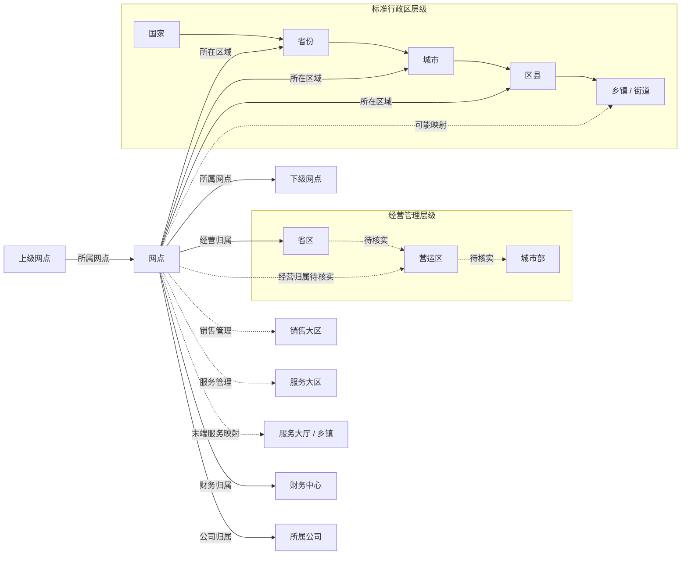

# 网点、部门与行政区域层级关系

> 文档用途：梳理融辉物流 TMS“基础资料”中的网点、部门和行政区域层级，为网点返利项目建立组织与主数据认知。  
> 查看日期：2026-09-16  
> 查看范围：网点管理、部门管理、行政区域。  
> 标记说明：**【页面已确认】**表示已从当前系统页面直接看到；**【结构推断】**表示根据页签名称和物流组织语义整理，仍需进入对应页面核实父级字段。

## 1. 核心结论

系统中至少存在四类相互关联但用途不同的层级或关系：

1. **标准行政区层级**：用于描述地址和服务区域，初步结构为“国家—省份—城市—区县—乡镇/街道”。
2. **经营管理层级**：用于公司内部区域化经营，页面包含“省区—营运区—城市部”，以及销售大区、服务大区等管理维度。
3. **网点层级**：网点之间可通过“所属网点”形成父子树；网点还可以关联行政区域、财务中心、公司和业务管理区域。
4. **部门维度**：部门是独立的基础资料类型，但当前页面没有记录，暂时不能确认其是否形成部门树。

网点是上述结构的业务落点。标准行政区回答“网点位于哪里”，经营管理层级回答“网点由谁管理”，网点树回答“网点隶属于哪个上级网点”，财务中心回答“网点由谁核算或结算”。这些关系不应合并成同一棵树。

## 2. 总体关系图



图中实线为页面字段或页签能够直接支持的关系；虚线为需要进一步进入子页面确认的关系。

## 3. 网点管理

### 3.1 页面结构【页面已确认】

网点管理页面由三部分组成：

- 左侧为网点名称搜索和网点树；
- 上方为查询条件；
- 中部为网点明细表格。

查看时页面显示约 **30,938 条网点记录**，分页为 **310 页**，每页 **100 条**。该数字是查看当时的页面结果，不作为长期固定规模。

### 3.2 网点树【页面已确认】

左侧网点树支持展开和收起。页面中可见“廊坊香河站”节点下挂多个以“香河”开头的子网点，说明网点之间存在父子关系。

网点树的核心关系可表达为：

```text
上级网点
  └─ 下级网点
       └─ 更下一级网点（系统是否限制层数待确认）
```

表格中的“所属网点”是形成这棵树的主要字段。当前页面不能证明网点树固定为两级，也不能仅凭名称判断“站、部、门店”分别处于哪一级。

### 3.3 查询和归属字段【页面已确认】

页面顶部可见的主要查询条件包括：

- 网点编号；
- 网点名称；
- 所属网点；
- 国家、省份、城市、区县；
- 所属财务中心；
- 所属公司；
- 网点类型；
- 启用标志；
- 网点级别。

这些字段表明，一个网点同时具有以下几种归属：

| 归属类型 | 主要字段 | 作用 |
| --- | --- | --- |
| 网点组织归属 | 所属网点 | 形成网点父子树 |
| 地理归属 | 国家、省份、城市、区县 | 标识网点所在地和区域筛选范围 |
| 财务归属 | 所属财务中心 | 确定核算、结算或财务管理范围 |
| 法人/公司归属 | 所属公司 | 标识网点对应的公司主体或管理公司 |
| 分类归属 | 网点类型、网点级别 | 区分网点业务类型和层级 |
| 状态属性 | 是否停用/启用标志 | 判断网点当前是否有效 |

### 3.4 非层级关联字段【页面已确认】

表格还包含以下网点间或服务类字段：

- 推荐网点；
- 绑定网点；
- 服务类型；
- 是否服务大厅；
- 是否允许自提；
- 负责人；
- 查询电话、经理电话、业务电话；
- 大区专属客服及电话；
- 派送范围、不派送范围、特殊区域；
- 超远乡镇及超远乡镇详情；
- 对外备注。

“推荐网点”和“绑定网点”属于网点间的横向关联，不能等同于“所属网点”的父子关系。“服务大厅”“派送范围”“超远乡镇”等字段体现网点与服务区域之间的关系，也不能直接用于推导组织上下级。

### 3.5 网点层级对返利项目的意义

网点返利应至少明确以下主体：

- 返利计算对象是当前网点、上级网点还是结算主体；
- 下级网点的业务量是否向上级网点汇总；
- 推荐网点或绑定网点是否参与返利归属；
- 网点停用、转隶或更换财务中心后，历史返利如何保留；
- 网点级别和网点类型是否决定不同的返利资格或计算规则。

## 4. 部门管理

### 4.1 页面现状【页面已确认】

部门管理页面查看时为 **0 条记录**。页面提供查询、新增、修改和删除功能，但当前没有可读取的部门数据。

页面表格包含：

- 部门名称；
- 状态；
- 使用对象；
- 网点类型；
- 创建时间。

### 4.2 当前判断

部门管理是独立于网点管理的基础资料模块。由于当前没有数据，不能确认：

- 部门是否支持父部门和子部门；
- 部门是否挂在公司、区域或网点下；
- “使用对象”具体指员工、网点、公司还是其他对象；
- 部门与省区、营运区、城市部是否存在直接映射。

因此，本项目暂时不把部门纳入已确认的层级主链。后续若系统启用部门数据，应单独梳理“组织部门树”，避免与网点树和区域树混淆。

## 5. 行政区域

### 5.1 页面页签【页面已确认】

行政区域页面包含以下 11 个维护页签：

1. 国家管理；
2. 省区管理；
3. 省份管理；
4. 营运区管理；
5. 城市部；
6. 销售大区管理；
7. 服务大区管理；
8. 城市管理；
9. 区县管理；
10. 乡镇/街道管理；
11. 服务大厅/乡镇管理。

这组页签同时包含标准行政区和企业经营区域，说明系统将两套区域体系放在同一模块维护，但两者的含义不同。

### 5.2 标准行政区层级【结构推断】

按页签命名，标准行政区主链为：

```text
国家
  └─ 省份
       └─ 城市
            └─ 区县
                 └─ 乡镇 / 街道
```

国家管理页面已看到的字段包括：

- 国家名称；
- 国家编号；
- 英文国家名；
- 二字码；
- 三字码；
- 备注。

除国家管理外，其余标准行政区页签尚未逐个核验父级字段，因此该层级目前依据页签语义整理。

### 5.3 企业经营区域层级【结构推断】

与企业经营管理相关的页签包括：

- 省区管理；
- 营运区管理；
- 城市部；
- 销售大区管理；
- 服务大区管理；
- 服务大厅/乡镇管理。

其中较可能的纵向管理主链为：

```text
省区
  └─ 营运区
       └─ 城市部
```

销售大区和服务大区更可能是不同业务职能下的区域划分，而不是标准行政区中的固定上下级。服务大厅/乡镇更可能用于把末端服务组织与乡镇范围建立映射。以上关系需要通过各页面的“所属省区、所属营运区、所属大区”等字段进一步确认。

### 5.4 两套区域体系的区别

| 体系 | 典型对象 | 回答的问题 | 是否应随行政区自动变化 |
| --- | --- | --- | --- |
| 标准行政区 | 国家、省份、城市、区县、乡镇/街道 | 网点和客户地址在哪里 | 按国家行政区划维护 |
| 经营管理区 | 省区、营运区、城市部 | 业务由哪个经营组织管理 | 可按公司经营需要调整 |
| 销售区域 | 销售大区 | 销售目标和客户拓展由谁负责 | 可跨行政区配置，待确认 |
| 服务区域 | 服务大区、服务大厅/乡镇 | 服务履约和末端覆盖由谁负责 | 可按网络覆盖调整，待确认 |

## 6. 层级关系汇总

### 6.1 已确认关系

| 上级/主对象 | 下级/关联对象 | 关系性质 | 依据 |
| --- | --- | --- | --- |
| 上级网点 | 下级网点 | 父子层级 | 网点树及“所属网点”字段 |
| 网点 | 国家/省份/城市/区县 | 地理映射 | 网点管理查询字段 |
| 网点 | 财务中心 | 财务归属 | “所属财务中心”字段 |
| 网点 | 公司 | 公司归属 | “所属公司”字段 |
| 网点 | 推荐网点/绑定网点 | 横向关联 | 网点表格字段 |
| 网点 | 派送/不派送/特殊区域 | 服务范围 | 网点表格字段 |

### 6.2 待确认关系

| 可能的上级 | 可能的下级 | 当前判断 |
| --- | --- | --- |
| 国家 | 省份 | 符合标准行政区结构，待字段核实 |
| 省份 | 城市 | 符合标准行政区结构，待字段核实 |
| 城市 | 区县 | 符合标准行政区结构，待字段核实 |
| 区县 | 乡镇/街道 | 符合标准行政区结构，待字段核实 |
| 省区 | 营运区 | 可能为经营管理上下级，待字段核实 |
| 营运区 | 城市部 | 可能为经营管理上下级，待字段核实 |
| 销售大区 | 网点或行政区域 | 可能为销售管理映射，待字段核实 |
| 服务大区 | 网点或行政区域 | 可能为服务管理映射，待字段核实 |
| 服务大厅 | 乡镇 | 页面名称显示存在映射，具体基数待确认 |
| 部门 | 网点/公司/人员 | 当前无数据，无法判断 |

## 7. 对网点返利数据模型的建议

返利系统应把以下关系分别建模，避免使用一个“区域”或“上级”字段承载所有含义：

1. **网点主数据**：网点编号、名称、类型、级别、状态和生效日期；
2. **网点父子关系**：上级网点、下级网点和关系有效期；
3. **行政区映射**：国家、省份、城市、区县、乡镇/街道；
4. **经营组织映射**：省区、营运区、城市部；
5. **职能区域映射**：销售大区、服务大区和服务大厅；
6. **财务归属**：财务中心和实际结算主体；
7. **网点横向关系**：推荐网点、绑定网点及关系类型；
8. **历史快照**：返利核算时保存当期网点层级和区域归属，防止后续转隶改变历史结果。

## 8. 后续核实清单

1. 逐个查看省区、营运区、城市部页面的父级字段，确认经营管理主链；
2. 确认销售大区、服务大区与省区/营运区是上下级还是独立维度；
3. 确认服务大厅与乡镇是一对一、一对多还是多对多关系；
4. 确认网点树允许的最大层级及各网点类型对应的层级；
5. 确认财务中心与公司、区域、网点之间的关系；
6. 确认推荐网点、绑定网点在返利计算中是否具有业务意义；
7. 确认部门模块当前为空是尚未启用、权限不可见还是确实没有数据。

## 9. 关联文档

- [融辉公司背景](./融辉公司背景.md)

