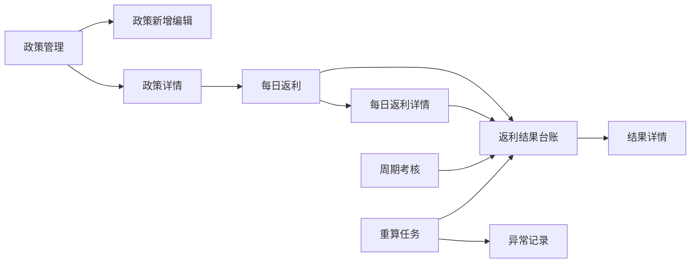
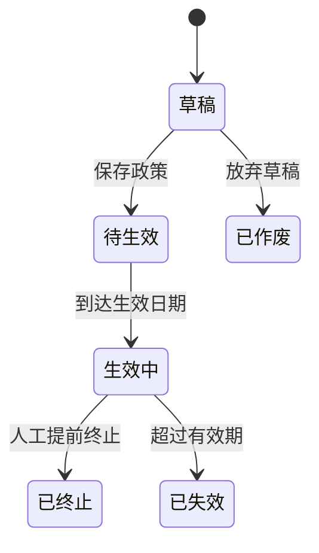
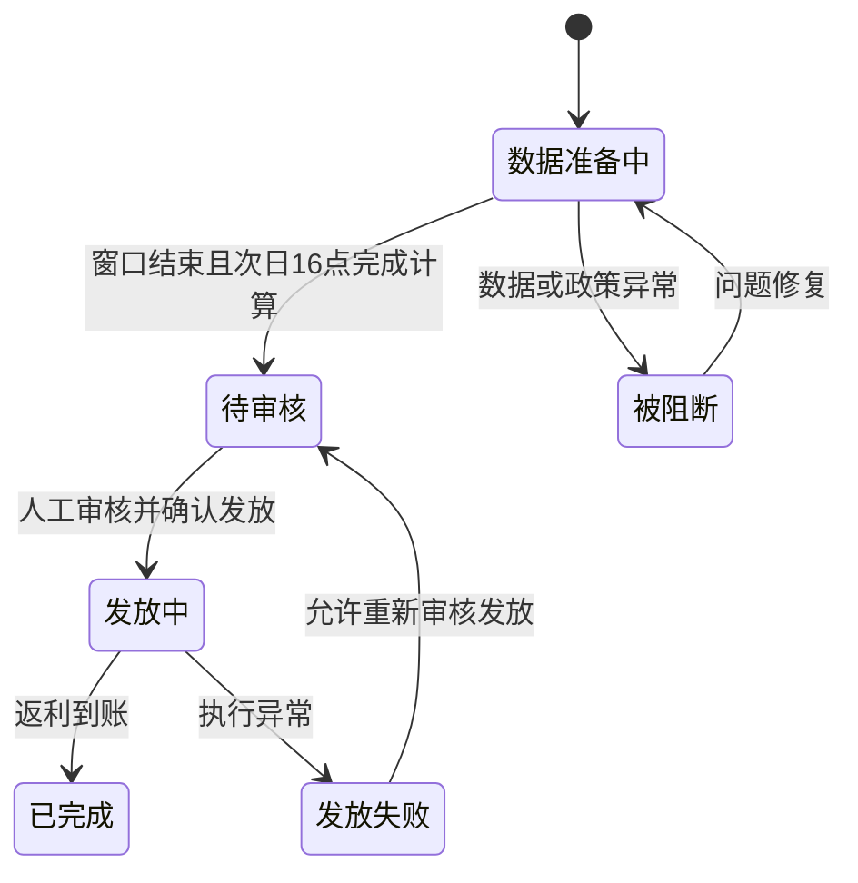
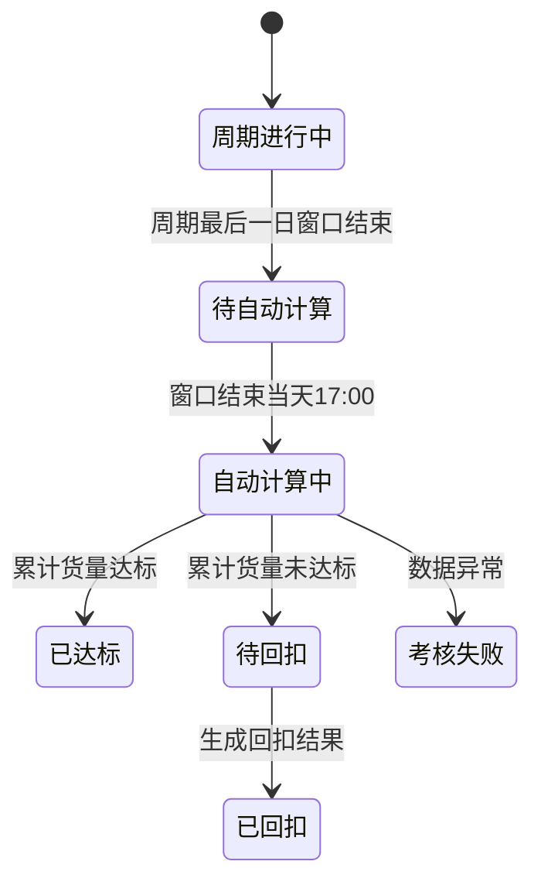
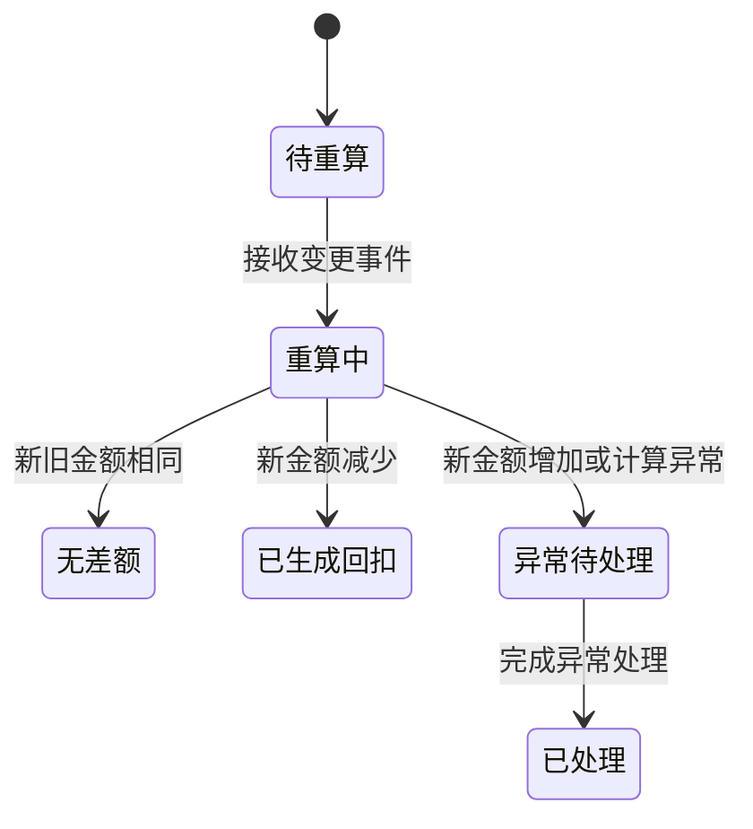
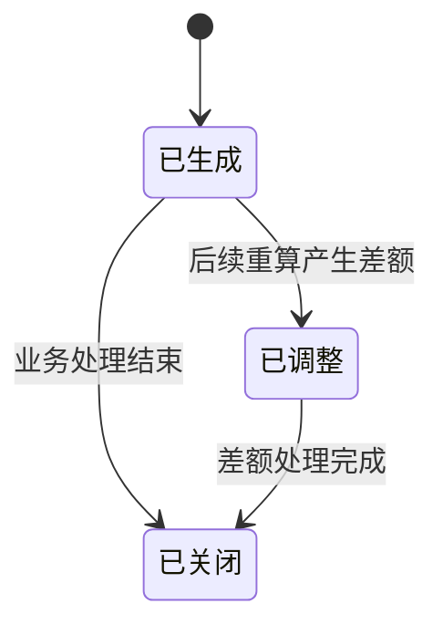
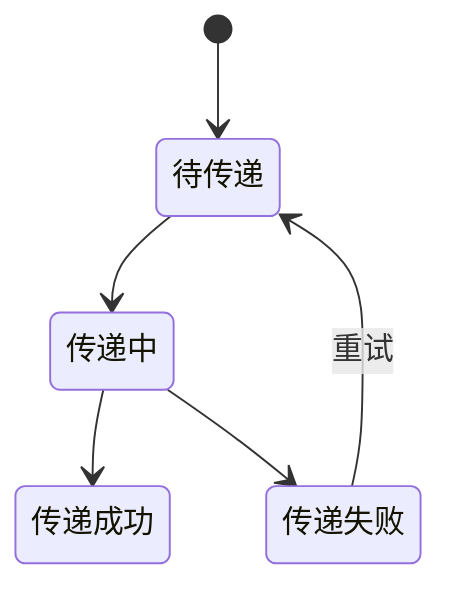

# 页面拆分与状态流转

> 版本：V0.4  
> 日期：2026-09-23  
> 文档性质：**参考草案，可在后续需求梳理、字段确认和原型设计中修改。**  
> 使用边界：本文用于建立页面全貌和页面间关系，不作为最终开发范围、字段定义或验收依据。字段以字段清单为准，计算规则以业务 PRD 为准。  
> 设计依据：《网点返利端到端业务流程图》《网点返利业务逻辑对齐稿》《页面模板与实例映射》。

## 一、拆分结论

当前阶段确认建设 **3 个一级功能页面**：

1. **政策导入**：上传、校验、导入和查询返利政策数据；支持几十万条数据的异步导入。
2. **每日返利**：系统计算每日返利，管理员人工点击返利，并可下钻查看具体奖励、扣减、回扣和运单组成信息。
3. **返利看板**：当前固定展示一个网点，默认以日历查看每日返利，支持按日、周、月、年切换汇总粒度；点击日期后查看当日各类型返利汇总，并通过趋势、结构、提醒和AI分析辅助经营判断。总部多网点查看方式待后续设计。

政策编辑、奖惩详情、周期考核、重算记录和异常信息作为三个主页面内的页签、抽屉或下钻页面承载，不再单独占用一级菜单。

## 二、系统目录

```text
网点返利
├─ 政策导入
│  ├─ 上传政策文件
│  ├─ 导入任务与进度
│  ├─ 校验结果与错误文件
│  └─ 已导入政策查询 / 编辑
│
├─ 每日返利
│  ├─ 每日计算结果
│  ├─ 管理员人工返利
│  └─ 奖惩详情下钻
│     ├─ 日奖励
│     ├─ 日回扣
│     ├─ 周期回扣
│     ├─ 重算调整
│     └─ 运单组成与计算过程
│
└─ 返利看板
   ├─ 日 / 周 / 月 / 年返利切换
   ├─ 金额卡片与可选整体时间范围
   ├─ 日期 / 周期返利金额
   ├─ 当日各类型返利汇总
   ├─ 返利趋势 / 类型结构 / 经营提醒
   └─ AI返利分析
```

## 三、核心页面清单

| 编号 | 页面名称 | 页面职责 | 核心操作 | 主要下钻内容 |
| --- | --- | --- | --- | --- |
| P-01 | 政策导入 | 导入和维护返利政策，跟踪大批量导入任务 | 上传文件、下载模板、查看进度、下载错误文件、查询和编辑政策 | 导入任务详情、校验结果、政策详情 |
| P-02 | 每日返利 | T+1日16:00后计算返利并由管理员人工审核发放 | 查询每日结果、检查阻断项、审核并发放、查看处理状态 | 奖励、扣减、周期回扣、重算调整、命中及剔除运单 |
| P-03 | 返利看板 | 固定展示一个网点，并按日、周、月、年查看返利金额和辅助分析 | 切换汇总粒度、选择时间范围、点击日期、发起AI分析 | 网点级日期返利、当日类型汇总、趋势、结构、经营提醒和AI解释 |

### 3.1 不单独占用一级菜单的功能

| 功能 | 承载位置 |
| --- | --- |
| 政策新增、编辑和日历预览 | P-01政策导入的政策维护区或抽屉 |
| 大批量导入进度与错误结果 | P-01导入任务页签和任务详情 |
| 奖励与扣减明细 | P-02每日返利详情页签或抽屉 |
| 周期考核与周期回扣 | P-02每日返利的周期结果页签 |
| 改单、删单和政策修改重算 | P-02奖惩详情中的调整记录页签 |
| 运单筛选与扫描校验 | P-02运单组成明细 |
| 日 / 周 / 月 / 年返利卡片、当日类型汇总和辅助分析 | P-03返利看板 |

## 四、内部视图参考结构

> 以下 V-01 至 V-10 是从原页面方案保留的内部视图参考，不代表一级菜单数量。

### V-01 政策管理

```text
页面标题：返利政策
参考归类：可按生效日期所属年份、月份倒序查看，但年月只用于页面归类，不作为政策字段展示或筛选
操作区：新增配置 / Excel导入 / 批量停用 / 批量删除
表格区：生效日期 / 寄件网点 / 目的流向 / 产品类型 / 货物类型 / 公斤段 / 考核周期 / 操作
分页区
```

行内操作：查看、编辑、删除。编辑页提供是否启用开关；列表另提供批量停用，不提供批量启用和复制上月。

### V-02 政策新增 / 编辑

```text
维护范围
  生效开始日期 / 生效结束日期 / 考核周期
  跨月范围自动按自然月拆分；周周期在每个自然月内重新按固定日期段计算

适用范围
  寄件网点 / 目的流向 / 产品类型（多选） / 货物类型（多选） / 公斤段（多选）
  三个多选字段均支持全选、单选、多选和标签删除，且均为必填
  实时提示类型组合数、自然月数及最终生成的原子政策数

基准量和返利单价
  日基准量 / 工作日基准量 / 周日基准量 / 节假日基准量
  日返利单价 / 工作日返利单价 / 周日返利单价 / 节假日返利单价
  优先级：节假日 ＞ 工作日或周日 ＞ 日

每日配置预览
  列表或日历 / 日期 / 星期 / 日期类型 / 有效基准量 / 有效返利单价
  输入上方规则后立即刷新，不显示配置来源

底部操作
  保存配置 / 取消
```

提交时先按生效日期覆盖的自然月拆分，再按产品类型×货物类型×公斤段的排列组合拆分。每条原子政策只保存三个维度的单值。保存前逐条校验必填、枚举、内部重复及与现有启用政策的效期冲突；任一组合失败时整次不保存并保持原政策不变，全部通过后再用生成结果替换原政策。

“保存草稿”是否保留取决于最终政策状态设计。若业务不需要草稿，可删除该动作。

### V-03 政策详情

```text
适用范围
每日基准与单价日历
关联返利结果摘要
操作日志
```

### V-04 每日返利

```text
页面标题：每日返利
日期筛选：默认定位当前可操作返利日
汇总区：待审核 / 已完成 / 被阻断 / 返利金额
操作区：当天返利
表格区：返利日 / 统计窗口 / 网点 / 流向 / 有效货量 / 应返金额 / 状态 / 阻断原因
```

返利统计日期T对应T日09:00至T+1日09:00。系统在T+1日16:00后计算日返利并生成待审核结果，管理员审核后发放；政策缺失、重叠或数据未同步完成时阻断。

### V-05 每日返利详情

```text
结果摘要：日基准 / 有效货量 / 超基准重量 / 单价 / 应返金额
政策快照
有效运单页签
剔除运单页签
扫描校验页签
计算过程与操作日志
```

### V-06 周期考核

```text
周期筛选：月份 / 固定周期 / 网点 / 流向 / 达标状态
汇总区：周期目标 / 周期有效货量 / 差额重量 / 已返金额 / 回扣金额
表格区：周期 / 网点 / 流向 / 目标 / 实际 / 达标状态 / 回扣状态
详情抽屉：每日组成和回扣公式
```

### V-07 返利结果台账

```text
筛选区：结果类型 / 业务日期 / 网点 / 流向 / 政策 / 结果状态 / 传递状态
汇总区：返利总额 / 回扣总额 / 净额 / 异常数量
表格区：结果编号 / 结果类型 / 来源日期或周期 / 金额 / 触发方式 / 状态 / 传递状态
```

结果类型建议统一包含：日返利、周期回扣、重算回扣、正差额异常。是否存在正式补差类型待确认。

### V-08 结果详情

```text
结果状态与金额
来源政策和来源批次
计算过程
订单或每日组成
原值 / 新值 / 差额
传递记录
操作日志
```

### V-09 重算任务

```text
筛选区：触发时间 / 触发类型 / 运单号 / 来源配置 / 任务状态
表格区：任务编号 / 触发对象 / 影响日期 / 影响周期 / 差额方向 / 状态 / 结果
详情：变更前后数据、受影响结果和执行日志
```

### V-10 异常记录

```text
筛选区：异常类型 / 发生时间 / 来源对象 / 处理状态
表格区：异常编号 / 异常类型 / 来源 / 影响范围 / 当前状态 / 负责人
处理抽屉：异常原因 / 关联记录 / 处理意见 / 处理日志
```

异常能否人工关闭、能否人工修改金额以及是否需要审核，均待后续确认。

## 五、页面关系图



页面之间的主要穿透关系：

- 从政策详情查看该政策产生的返利结果。
- 从每日返利查看当天的计算详情和结果记录。
- 从周期考核查看周期回扣结果。
- 从重算任务查看新旧结果及差额记录。
- 从结果详情返回来源政策、日计算或重算任务。

## 六、状态设计原则

1. **政策状态、计算状态、结果状态、传递状态必须分开。**同一条记录不能用一个“状态”同时表达四件事。
2. **页面只展示自己负责的主状态。**其他状态作为辅助字段，避免用户无法判断下一步操作。
3. **状态必须能说明下一步动作。**例如“被阻断”必须同时展示阻断原因和处理入口。
4. **已形成的历史结果不可覆盖。**重算产生新的差额记录，并通过关联关系追溯原结果。
5. 以下状态名称为产品参考，待业务流程和权限确认后才能进入正式 PRD。

## 七、政策状态流转（参考）



| 状态 | 含义 | 允许的主要动作 | 备注 |
| --- | --- | --- | --- |
| 草稿 | 配置未完成或尚未正式保存 | 编辑、删除草稿、检查 | 是否需要草稿待确认 |
| 待生效 | 已保存但未到生效时间 | 查看、按权限修改或终止 | 修改是否生成新版本待确认 |
| 生效中 | 当前参与运单匹配和计算 | 查看、发起变更、提前终止 | 生效政策修改后需触发历史重算 |
| 已终止 | 被人工提前终止 | 查看、复制 | 终止对未结束周期的影响待确认 |
| 已失效 | 已超过有效期 | 查看、复制 | — |
| 已作废 | 草稿被放弃 | 查看 | 是否保留作废草稿待确认 |

审批状态未纳入本图，因为当前尚未确认是否需要政策审批。

## 八、每日返利批次状态流转（参考）



| 状态 | 页面表现 | 允许动作 |
| --- | --- | --- |
| 数据准备中 | 按钮不可用，显示预计开放时间 | 查看当前数据准备情况 |
| 被阻断 | 显示阻断原因 | 查看缺失政策、重叠政策或数据同步问题 |
| 待审核 | “审核并发放”按钮可用 | 人工审核、查看计算详情并确认发放 |
| 发放中 | 按钮进入加载状态，禁止重复点击 | 查看执行进度 |
| 已完成 | 展示结果编号和金额 | 查看结果、查看运单明细 |
| 发放失败 | 展示失败原因 | 修复后重新审核发放 |

当日无符合条件运单时，系统在T+1日16:00后生成金额为0的结果，无需发放。

## 九、周期考核状态流转（参考）



周期考核和扣款由系统自动执行，不提供人工触发入口。周期最后一个返利统计日的数据窗口结束当天17:00自动计算整个周期扣款，例如1—7日周期在8日17:00执行。

## 十、重算任务状态流转（参考）



| 差额结果 | 当前处理 |
| --- | --- |
| 新金额减少 | 自动生成回扣记录，不需要人工再次发起 |
| 新旧金额相同 | 记录无差额并结束任务 |
| 新金额增加 | 记录正差额异常，暂不自动补差 |
| 计算执行失败 | 进入异常记录，保留失败原因和执行日志 |

## 十一、结果与传递状态（参考）

### 结果状态



“已关闭”是否需要人工操作以及关闭条件尚未确认，可以在后续状态机设计中删除或调整。

### 传递状态



传递状态属于后续资金或结算接口范围。当前页面可以预留展示位置，暂不固化接口按钮和处理规则。

## 十二、跨页面状态映射

| 业务事件 | 来源页面 | 状态变化 | 结果页面 |
| --- | --- | --- | --- |
| 保存新政策 | V-02 | 草稿或编辑中 → 待生效 | V-01、V-03 |
| 到达政策生效日期 | 系统 | 待生效 → 生效中 | V-01、V-03 |
| T+1日16:00且数据完整 | 系统 | 数据准备中 → 待审核 | V-04 |
| 人工审核并发放 | V-04 | 待审核 → 发放中 → 已完成或失败 | V-04、V-05、V-07 |
| 固定周期数据窗口结束 | 系统 | 周期进行中 → 待自动计算 | V-06 |
| 窗口结束当天17:00 | 系统 | 待自动计算 → 自动计算中 → 已达标或待回扣 | V-06、V-07 |
| 周期未达标 | 系统 | 自动计算中 → 待回扣 → 已回扣 | V-06、V-07 |
| 运单或政策变化 | 外部来源或V-02 | 创建待重算任务 | V-09 |
| 重算金额减少 | 系统 | 重算中 → 已生成回扣 | V-09、V-07 |
| 重算金额增加 | 系统 | 重算中 → 异常待处理 | V-09、V-10 |
| 结果传递成功 | 后续接口 | 待传递 → 传递成功 | V-07、V-08 |

## 十三、待后续调整的页面决策

| 决策项 | 当前建议 | 调整触发条件 |
| --- | --- | --- |
| 每日返利是否作为模块首页 | 建议作为高频操作入口 | 实际主要用户并非每日操作人员时调整 |
| 政策新增是否独立页面 | 建议独立页面 | 配置字段很少时可改为抽屉 |
| 周期考核是否独立页面 | 暂独立 | 若只展示少量结果，可合并到结果台账 |
| 重算任务与异常记录是否分开 | 暂分开 | 异常量很少时可合并为一个页面的两个页签 |
| 结果详情使用页面还是抽屉 | 暂允许两种方案 | 字段清单和明细数量确定后选择 |
| Excel导入是否保留 | 暂保留入口设想 | 业务确认完全改为系统维护时删除 |
| 接口传递是否单独建页 | 当前不单独建页 | 后续需要批量重试、对账或人工处理时再增加 |

## 十四、后续使用方式

1. 需求确认阶段可以直接增删页面，但需要同步更新目录和页面关系。
2. 字段清单阶段按页面归属整理字段，但字段定义只在字段清单中维护。
3. 业务 PRD 阶段确认正式状态机后，替换本文中的参考状态。
4. Demo PRD 和 HTML 原型只实现当时已确认的页面，不要求一次覆盖本文全部参考页面。

