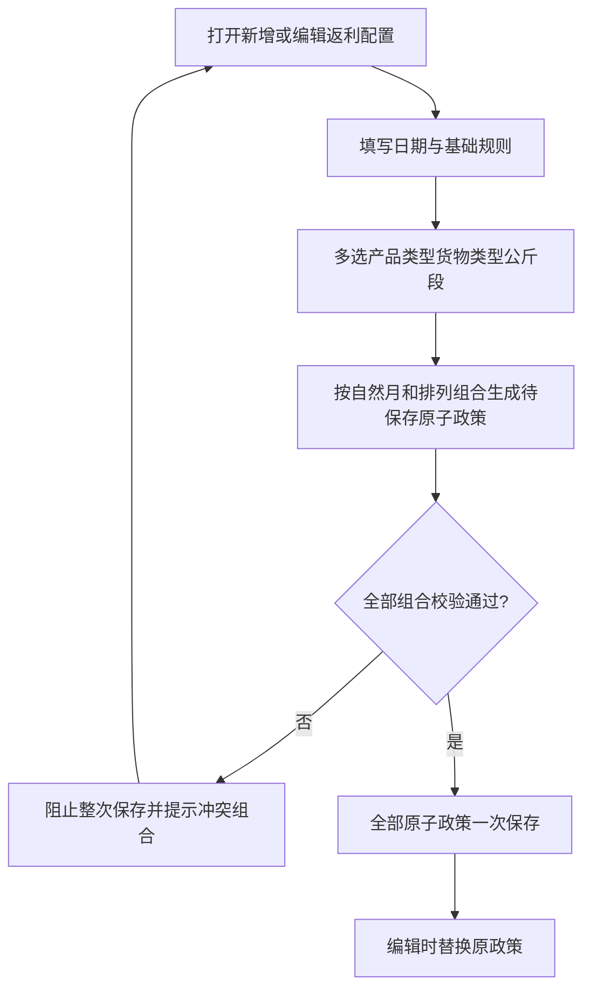
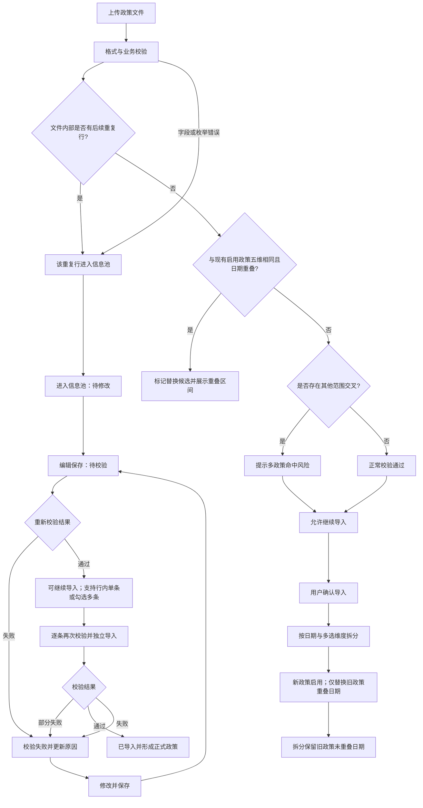
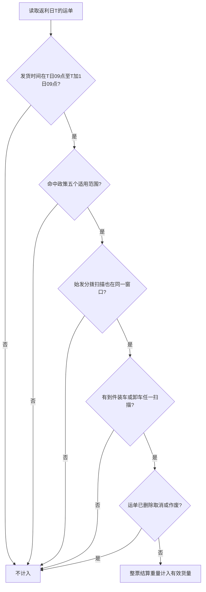
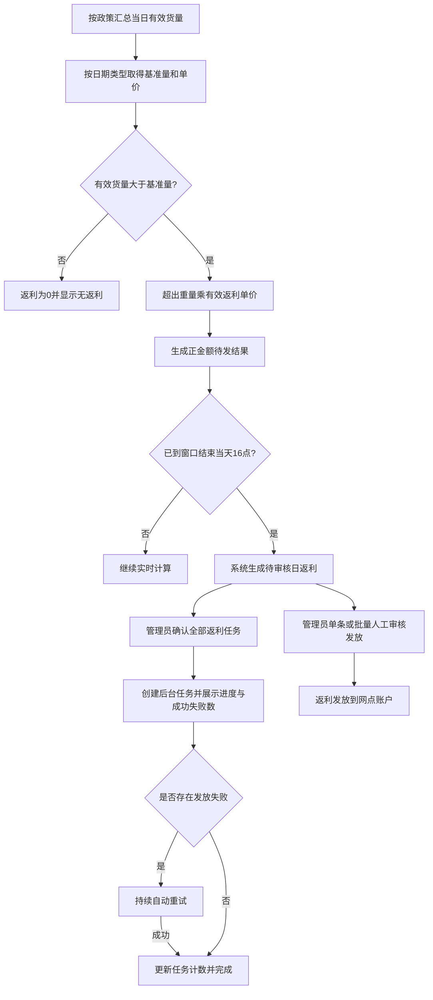
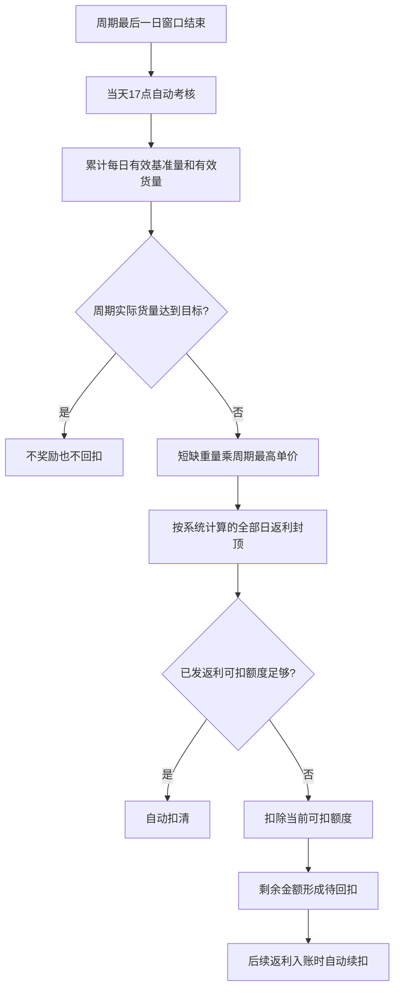
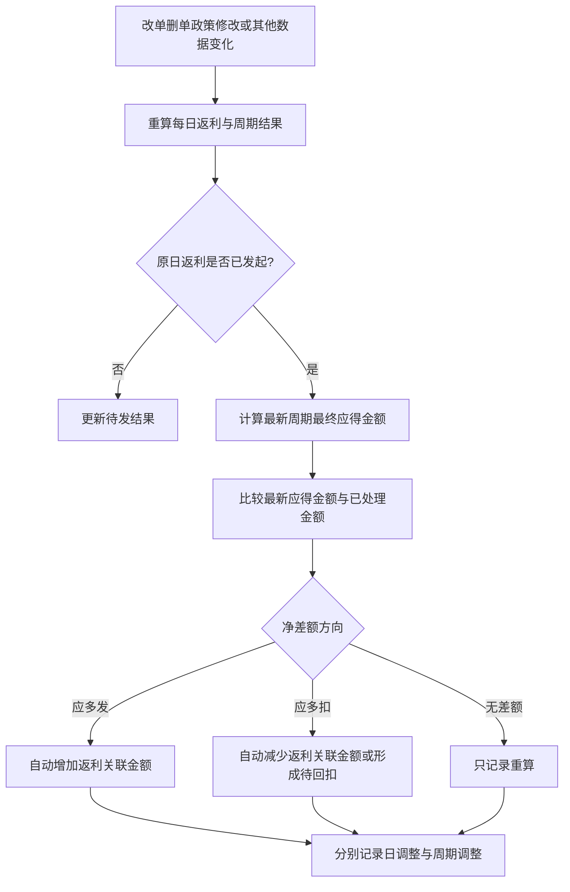
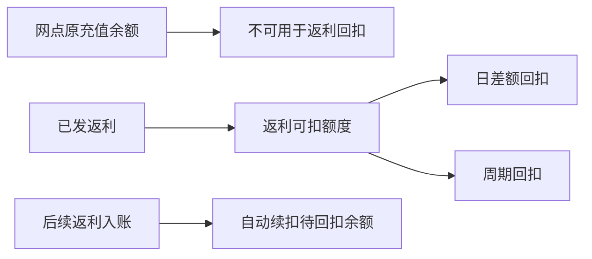

# 网点返利端到端业务流程图

> 版本：V1.3
> 日期：2026-09-28  
> 依据：《网点返利规则梳理问答记录》《网点返利业务逻辑对齐稿》

## 一、总流程


## 二、政策配置与导入流程

### 2.1 手工新增或编辑



手工编辑的产品类型、货物类型、公斤段均支持全选、单选和多选且为必填。任一拆分结果存在必填、枚举、内部重复或启用政策效期冲突时，整次不保存，原政策保持不变。

### 2.2 Excel导入



同维度效期冲突判断：寄件网点、目的流向、产品类型、货物类型、公斤段完全相同且生效日期重叠，考核周期、基准量或单价不同也不能绕过。Excel文件内部后续重复行进入信息池；与现有启用政策重叠的导入行作为替换候选，用户确认后仅替换重叠日期，旧政策未重叠日期拆分保留。手工新增冲突时阻止保存。

## 三、有效运单归集流程



目的流向按最终派件分拨判断。营运区政策使用导入时保存的营运区—分拨快照。

## 四、每日返利流程



```text
日返利金额 = max（日有效货量－日有效基准量，0）× 日有效返利单价
```

“全部返利”按当前筛选条件选择所有可发结果，不受分页限制，并展示记录数和总金额。管理员确认后创建后台任务，按确认时锁定的记录范围和金额执行；任务展示进度、成功数和失败数，离开页面后继续运行。失败记录显示“发放失败 / 重试中”并持续自动重试直至成功；任务完成后显示成功结果，重试不得重复入账。

## 五、周期考核流程



```text
周期目标货量 = 周期内生效日的每日有效基准量之和
周期实际货量 = 周期内生效日的每日有效货量之和
周期应回扣 = min（周期短缺重量 × 周期最高返利单价，周期内系统计算的全部日返利）
```

周周期按每月1—7日、8—14日、15—21日、22—28日、29日—月末；月周期按自然月。中途生效或结束只累计生效范围内日期。

## 六、变更重算与返利关联金额调整流程



```text
周期最终应得金额 = 最新日返利总额－最新周期应回扣金额
本次差额 = 周期最终应得金额－已经处理的金额
```

系统对同一数据变化只调整一次返利关联金额，明细层分别记录每日返利变化和周期回扣变化。该重算调整和周期回扣不发生真实资金划转；周期短缺减少或重新达标时，系统自动减少或取消待回扣，并调增已多扣的返利关联金额。

## 七、返利资金边界



系统独立记录累计已发返利、累计已扣返利、剩余返利可扣额度和待回扣余额。

## 八、已确认的操作边界

- 总部返利管理员管理政策并可查看全部网点、发起返利；网点人员仅查看本人所属网点。
- 单条、批量和全部返利由总部返利管理员确认即可执行，不要求第二人复核。
- 信息池支持单条和批量继续导入；批量按行独立复校验和提交，失败行保留最新原因，不影响成功行。
**修订记录：**2026-09-28，V1.2，补充信息池单条和批量继续导入及逐条独立校验。
