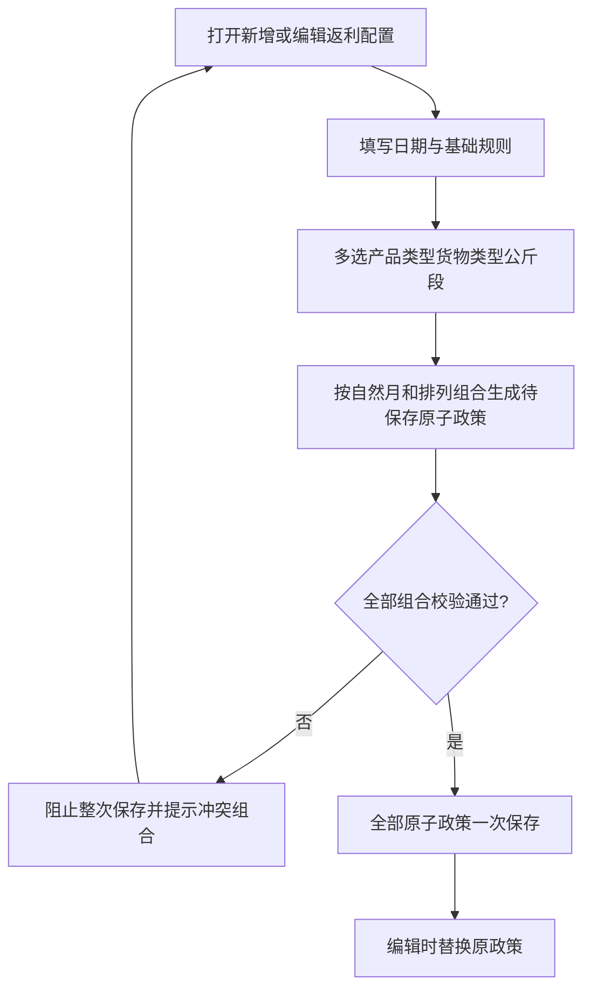
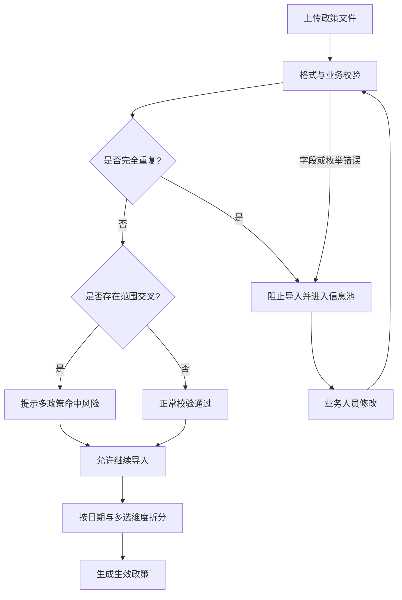
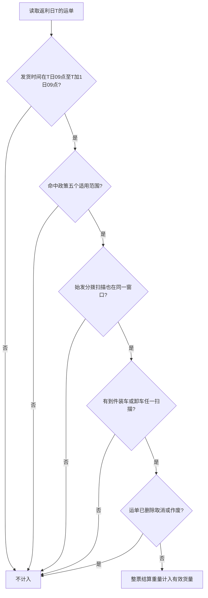
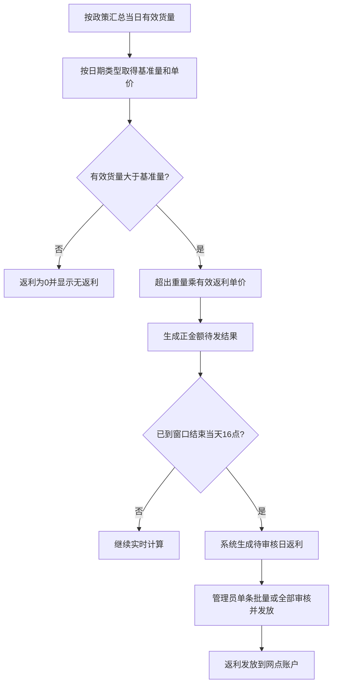
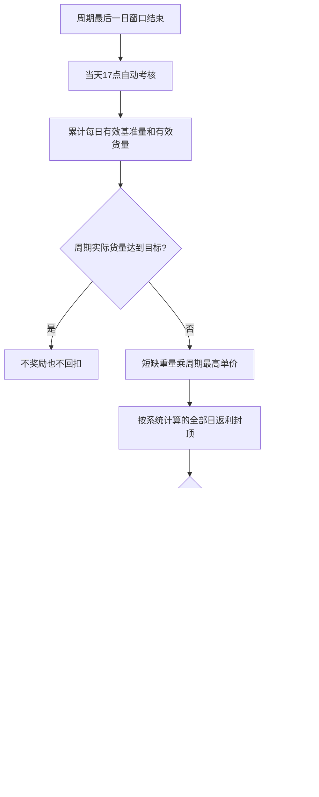
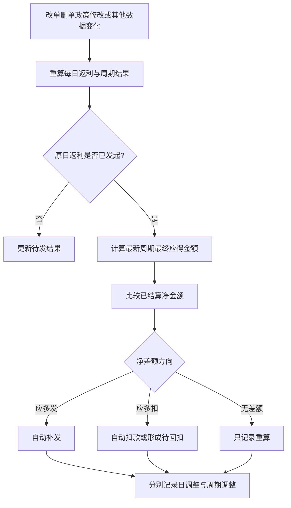
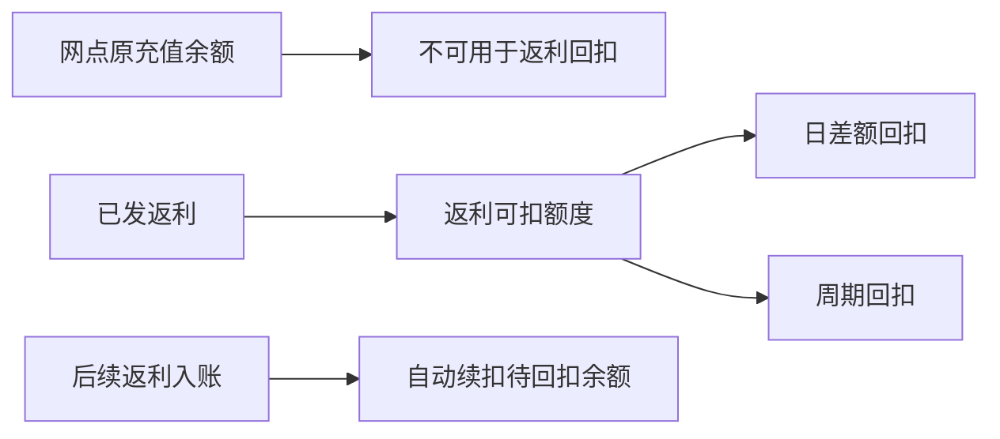

# 网点返利端到端业务流程图

> 版本：V0.7  
> 日期：2026-09-23  
> 依据：《网点返利规则梳理问答记录》《网点返利业务逻辑对齐稿》

## 一、总流程


## 二、政策配置与导入流程

### 2.1 手工新增或编辑



手工编辑的产品类型、货物类型、公斤段均支持全选、单选和多选且为必填。任一拆分结果存在必填、枚举、内部重复或启用政策效期冲突时，整次不保存，原政策保持不变。

### 2.2 Excel导入



重复配置判断：寄件网点、目的流向、产品类型、货物类型、公斤段完全相同，且生效日期重叠。考核周期、基准量或单价不同也视为重复。Excel导入允许合格行先导入、失败行进入信息池；手工新增或编辑不允许部分保存。

## 三、有效运单归集流程



目的流向按最终派件分拨判断。营运区政策使用导入时保存的营运区—分拨快照。

## 四、每日返利流程



```text
日返利金额 = max（日有效货量－日有效基准量，0）× 日有效返利单价
```

“全部返利”按当前筛选条件选择所有可发结果，不受分页限制，并展示记录数和总金额。

## 五、周期考核流程



```text
周期目标货量 = 周期内生效日的每日有效基准量之和
周期实际货量 = 周期内生效日的每日有效货量之和
周期应回扣 = min（周期短缺重量 × 周期最高返利单价，周期内系统计算的全部日返利）
```

周周期按每月1—7日、8—14日、15—21日、22—28日、29日—月末；月周期按自然月。中途生效或结束只累计生效范围内日期。

## 六、变更重算与净额结算流程



```text
周期最终应得金额 = 最新日返利总额－最新周期应回扣金额
本次资金差额 = 周期最终应得金额－已经实际结算的净金额
```

资金层只执行一次净差额，明细层分别记录每日返利变化和周期回扣变化。周期短缺减少或重新达标时，系统自动取消待回扣并退回已经多扣的金额。

## 七、返利资金边界



系统独立记录累计已发返利、累计已扣返利、剩余返利可扣额度和待回扣余额。

## 八、当前待确认

| 编号 | 问题 | 影响范围 |
| --- | --- | --- |
| P-01 | 大批量全部返利是否创建后台任务 | 任务进度、失败重试、防重复 |
| P-02 | 信息池的完整状态流转 | 导入处理与权限 |
| P-03 | 重量、基准量和返利金额的精度及计算舍入时点（返利单价已确认最多两位小数、页面显示两位） | 计算与对账 |
| P-04 | 自动发款或扣款失败后的处理 | 账户、接口与对账 |
| P-05 | 政策及返利操作权限 | 权限矩阵与复核 |

**修订记录：**2026-09-23，V0.7，确认返利单价最多两位小数并统一页面显示；金额和重量精度仍待确认。
