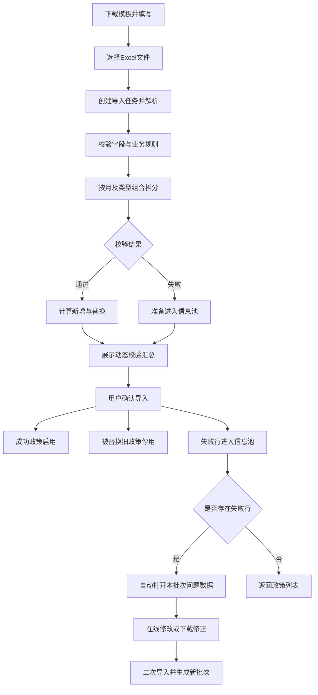
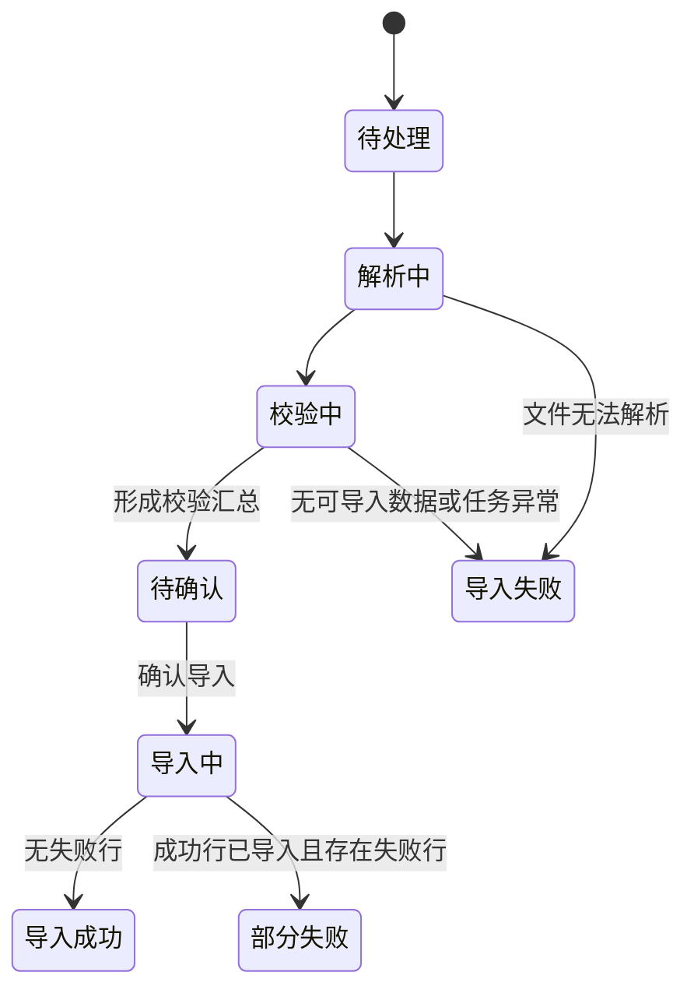

# 政策导入业务 PRD

> **版本**：V1.3 | 2026-09-23  
> **读者**：研发工程师、测试工程师、产品复核  
> **字段权威源**：[政策管理字段清单](../字段清单/政策管理.tsv)  
> **交互规格**：[政策导入交互PRD](../交互PRD/政策导入交互PRD.md)  
> **编写边界**：[PRD 编写边界](../../01-全局背景信息/PRD编写边界.md)

界面、Excel模板和问题数据中的字段名称统一使用**公斤段**；“公斤段”仅作为正文中的业务概念简称。

---

## 数据来源人工确认规则（全局前置条件）

本模块为独立模块，凡使用网点、目的流向、产品类型、货物类型、公斤段等外部系统主数据，均须由业务负责人和对应来源系统负责人在开发联调前人工确认字段映射。每项映射至少记录：**本模块字段、来源系统及模块、来源字段名称/编码、业务含义与匹配口径、数据类型/单位/枚举转换、更新时间或取数时点、确认人、确认日期**。

未完成确认的字段统一标记为“待确认数据来源”，不得根据页面同名字段、Excel示例或经验自行认定映射关系，也不得作为导入校验、重复判断、接口联调或验收的最终口径。一个目标字段由多个来源字段计算时，须同时确认转换规则和空值、异常值处理方式；来源字段或口径变更后须重新人工确认。本规则只约束数据对接与验收，不要求页面展示数据来源信息。

## 1. 模块目标

政策导入用于业务人员通过 Excel 批量创建、替换和维护网点返利政策。系统需要在几十万行数据场景下完成字段校验、自然月拆分、类型排列组合、重复判定、部分成功导入和失败数据闭环处理。

核心结果是：合格数据形成可参与返利匹配的原子政策；失败数据进入可修改、可下载、可二次导入的信息池；每次导入和替换均可追溯。

## 2. 范围

| 功能 | 说明 |
| :--- | :--- |
| 模板下载 | 下载当前有效的四档公斤段导入模板 |
| 文件上传与校验 | 读取 Excel，校验字段、格式、枚举、主数据、日期及重复配置 |
| 校验汇总 | 展示本次新增、替换、失败及拆分后生成政策数量，不展示逐条差异预览表格 |
| 部分成功导入 | 合格行先导入，失败行进入信息池，不互相阻塞 |
| 政策替换 | 新数据命中当前启用的同维度重叠政策时，旧政策自动停用，新政策启用 |
| 导入任务 | 保存批次、文件、数量、状态、操作人和时间 |
| 问题信息池 | 展示、在线编辑、删除、批量下载问题数据，并支持二次导入 |
| 重复导入 | 同一文件再次导入时重新计算当前差异，不复用历史说明 |

**不在范围：**返利计算、返利发放、周期回扣和返利看板。

政策配置页的手工新增、编辑由《政策配置业务PRD》定义；其自然月拆分、三维排列组合、原子政策和重复判定口径必须与本导入规则一致。处理失败时，手工编辑整次不保存，Excel导入仍按本文件执行合格行先导入、失败行进入信息池。

## 3. 角色与权限结果

| 角色 | 能力 |
| :--- | :--- |
| 政策维护人员 | 下载模板、上传文件、查看校验结果、确认导入、查看导入任务、处理问题数据 |
| 政策查看人员 | 查看政策列表和导入结果，不执行导入、修改或删除 |
| 系统 | 校验、拆分、替换、生成批次、记录历史、打开问题数据页面 |

具体角色名称与权限分配沿用现有工程权限体系。

## 4. 业务流程

## 5. 核心业务规则

| 规则ID | 规则 |
| :--- | :--- |
| R-001 | Excel 字段名称、类型、来源和枚举以《政策管理字段清单》为准。 |
| R-002 | 生效结束日期不得早于生效开始日期；跨自然月时先按每个自然月拆分生效区间。 |
| R-003 | 产品类型、货物类型、公斤段支持英文逗号分隔多值，按三类取值笛卡尔积拆分；每条正式政策只保存一个产品类型、一个货物类型和一个公斤段。 |
| R-004 | 单行最终生成数量＝覆盖自然月数量×产品类型数量×货物类型数量×公斤段数量。 |
| R-005 | 寄件网点、目的流向、产品类型、货物类型、公斤段相同且生效日期重叠，视为重复；考核周期、基准量或单价不同不能绕过重复判定。 |
| R-006 | 文件内部重复按 Excel 行顺序处理：首次出现且通过其他校验的行可导入，后续重复行进入信息池。 |
| R-007 | 新导入政策与当前启用政策重复时按“替换”处理：旧政策自动停用，新政策启用并保留两版历史。 |
| R-008 | 字段缺失、格式错误、枚举无法识别、主数据无法匹配、文件内重复等失败行进入信息池。 |
| R-009 | 一批数据允许部分成功：成功行先形成政策，失败行不回滚成功行。 |
| R-010 | 同一文件重复导入时，必须基于本次文件内容与当前启用政策重新计算新增、替换和失败数量；历史批次只用于提示和追溯。 |
| R-011 | 每次确认导入生成新批次，不覆盖历史批次、历史问题数据或旧政策版本。 |
| R-012 | 导入完成且存在失败数据时自动打开本批次问题数据；全部成功时返回政策列表。 |
| R-013 | 信息池支持在线编辑和删除；删除只移除待处理记录，不影响正式政策、原导入批次和导入日志。 |
| R-014 | 信息池支持下载勾选记录或当前批次全部问题数据，文件保留原 Excel 行号、完整导入字段和失败原因。 |
| R-015 | 修正文件二次导入时重新执行全部校验并生成新批次；通过行进入正式政策，失败行进入新批次信息池。 |
| R-016 | 同名文件历史次数只用于提示，不作为内容相同的唯一判定依据。 |
| R-017 | 手工新增或编辑中的产品类型、货物类型、公斤段同样支持多选，并复用R-002至R-005的拆分与重复口径；任一生成组合校验失败时整次不保存，不适用R-009的部分成功机制。 |
| R-018 | Excel中的日、工作日、周日、节假日返利单价最多保留两位小数；超出时作为格式校验失败行进入信息池，不静默舍入。导入预览及政策页面统一显示两位小数。 |

## 6. 导入任务状态

| 状态 | 用户可见结果 |
| :--- | :--- |
| 待处理、解析中、校验中、导入中 | 展示任务进度，不将未完成数据作为正式政策参与计算 |
| 待确认 | 展示新增、替换、失败和生成政策数量，可确认或取消 |
| 导入成功 | 全部合格数据已形成正式政策 |
| 部分失败 | 合格数据已形成政策，失败数据已进入信息池 |
| 导入失败 | 未形成正式政策，展示失败原因和重试入口 |

## 7. 信息池状态

| 当前状态 | 触发动作 | 后置状态 | 结果 |
| :--- | :--- | :--- | :--- |
| 待修改 | 在线编辑并保存 | 待校验 | 保留原始数据，写入修正后数据 |
| 待修改/待校验/校验失败 | 下载并修正后二次导入 | 新批次处理中 | 原记录与原批次保留 |
| 待校验 | 重新校验通过并继续导入 | 已导入 | 生成正式政策并记录新批次 |
| 待校验 | 重新校验失败 | 校验失败 | 更新失败原因 |
| 任一未完成状态 | 删除 | 已移除 | 只移除信息池待处理记录 |

## 8. 数据规模与结果要求

1. 单个导入文件可能包含几十万条数据；文件上传后应形成可持续处理的导入任务，用户离开页面不得导致已创建任务丢失。
2. 未处理完成的数据不得参与正式政策匹配。
3. 导入任务必须展示总行数、已处理或通过数量、失败数量、替换数量、操作人和时间。
4. 页面不得要求一次性展示几十万条明细；列表和问题信息按可用方式分页或分段加载，具体实现由技术设计确定。
5. 重复确认、页面刷新或网络重试不得导致同一导入任务重复执行；具体幂等方案由技术设计确定。

## 9. 异常与边界

| 场景 | 系统处理 |
| :--- | :--- |
| 文件格式不支持或无法解析 | 阻止进入预览，展示可理解的失败原因 |
| 文件没有业务数据 | 阻止确认导入，提示文件无可导入数据 |
| 全部行失败 | 不生成正式政策，全部问题行进入信息池并自动打开问题页面 |
| 部分行失败 | 成功行正常导入，失败行进入信息池 |
| 文件内重复 | 首行按正常规则处理，后续重复行进入信息池 |
| 命中当前启用政策 | 预览显示替换，确认后旧政策停用、新政策启用 |
| 同一文件再次选择 | 重新触发解析与校验，可显示历史导入次数 |
| 信息池在线删除 | 不删除原始导入日志和已成功政策 |
| 二次导入再次失败 | 失败数据进入新批次信息池，原批次不覆盖 |

## 10. 验收重点

| # | 输入条件 | 预期结果 |
| :--- | :--- | :--- |
| V-001 | 一行跨2个月，含2个产品、3个货物类型、4个公斤段 | 生成48条原子政策 |
| V-002 | 文件内两行重复 | 首次出现行按正常规则处理，后续行进入信息池并标记重复配置 |
| V-003 | 新数据命中24条当前启用政策 | 预览显示替换24条；确认后旧24条停用、新24条启用 |
| V-004 | 同一文件确认导入后再次上传 | 按当前启用政策重新计算，新增与替换说明发生相应变化，不显示上一次固定结果 |
| V-005 | 2行成功、1行失败 | 成功行先导入，失败行进入信息池，任务状态为部分失败 |
| V-006 | 导入完成存在失败行 | 自动打开本批次问题数据页面 |
| V-007 | 导入全部成功 | 返回政策列表，不打开问题页面 |
| V-008 | 信息池勾选多条下载 | 下载文件包含所选问题行、原行号、全部导入字段和失败原因 |
| V-009 | 修正下载文件后二次导入 | 创建新批次并重新执行全部校验，原批次可继续追溯 |
| V-010 | 删除信息池记录 | 仅待处理记录消失，正式政策和导入日志不变 |
| V-011 | 手工编辑生成24个组合且其中1个冲突 | 24个组合均不保存，原政策保持不变；不得将其按Excel部分成功规则处理 |
| V-012 | 导入返利单价含3位小数 | 对应行校验失败并进入信息池，单价不自动舍入 |

## 11. 待确认

1. 大文件导入完成时限、并发任务数量及任务保留期限。
2. 全部行失败时批次状态使用“导入失败”还是“部分失败”的最终术语。
3. 信息池在线修改后是否提供单条“重新校验并继续导入”，当前原型以二次导入为主。
4. 货物类型“轻泡/重泡”与返利管理“轻抛/重抛”的业务编码映射。

## 12. 修订记录

| 日期 | 版本 | 变更摘要 |
| :--- | :--- | :--- |
| 2026-09-23 | V1.3 | 补充手工编辑与Excel导入共用拆分、原子政策和重复口径，并明确两者失败处理差异 |
| 2026-09-23 | V1.4 | 补充Excel返利单价最多两位小数及超精度进入信息池的校验规则 |
| 2026-09-20 | V1.0 | 建立完整导入、动态重复导入、信息池、批量下载、二次导入及自动弹出问题页面规则 |
| 2026-09-21 | V1.1 | 移除逐条差异预览表格，保留汇总数字和动态说明 |
