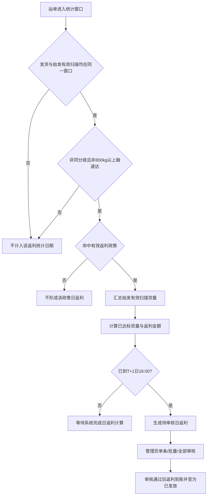
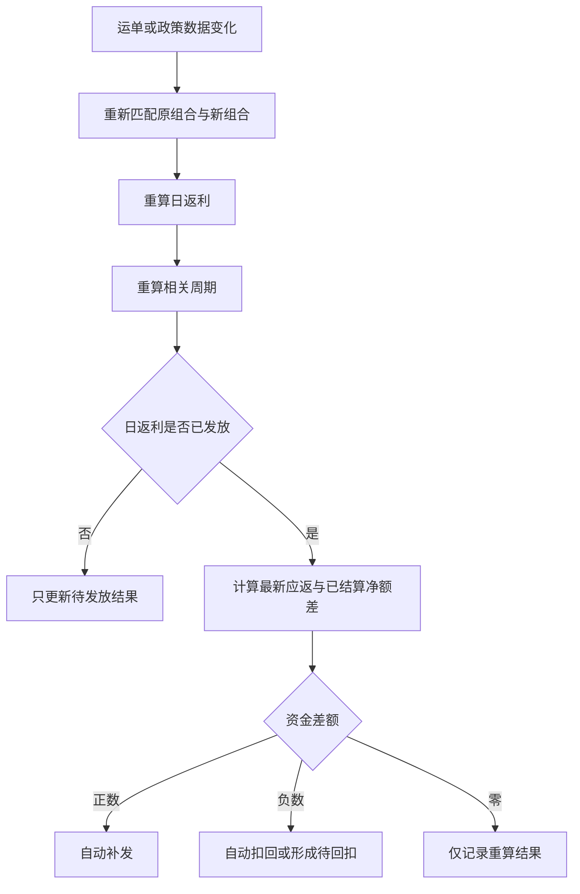

# 返利管理业务 PRD

> **版本**：V1.9 | 2026-09-23  
> **读者**：研发工程师、测试工程师、产品复核  
> **字段权威源**：[返利管理字段清单](../字段清单/返利管理.tsv)  
> **政策字段源**：[政策管理字段清单](../字段清单/政策管理.tsv)  
> **交互规格**：[返利管理交互PRD](../交互PRD/返利管理交互PRD.md)  
> **编写边界**：[PRD 编写边界](../../01-全局背景信息/PRD编写边界.md)

日返利、周期返利及筛选区的界面字段名称统一使用**公斤段**；“公斤段”仅作为正文中的业务概念简称。

---

## 数据来源人工确认规则（全局前置条件）

本模块为独立模块，凡使用运单、扫描、组织、账户、节假日等外部系统数据，均须由业务负责人和对应来源系统负责人在开发联调前人工确认字段映射。每项映射至少记录：**本模块字段、来源系统及模块、来源字段名称/编码、业务含义与统计口径、数据类型/单位/枚举转换、更新时间或取数时点、确认人、确认日期**。

未完成确认的字段统一标记为“待确认数据来源”，不得根据页面同名字段、原型示例或经验自行认定映射关系，也不得作为接口联调、计算结果或验收的最终口径。一个目标字段由多个来源字段计算时，须同时确认计算公式和空值、异常值处理规则；来源字段或口径变更后须重新人工确认并评估历史返利重算范围。本规则只约束数据对接与验收，不要求页面展示数据来源信息。

## 1. 模块目标

返利管理用于按已生效政策实时计算每日返利，由管理员人工完成首次发放，并自动完成发放后的补发、扣回以及周/月周期考核回扣。所有计算来源、变化原因和资金调整必须可追溯。

## 2. 功能范围

| 页签/能力 | 说明 |
| :--- | :--- |
| 日返利 | 查询每日计算结果，查看有效运单和计算明细，执行单条、批量或全部返利 |
| 返利详情 | 查看当前运单、返利变化和运单变化，追溯发放后重算 |
| 查看周期返利 | 从日返利进入周或月日历，查看每日重量、基准和返利表现 |
| 周期返利 | 查询周/月周期累计结果、扣罚和总返利；仅查看，系统自动执行 |
| 周期详情 | 日返利“周期返利”和周期返利列表“详情”进入同一页面；查看周期概览与返利变化 |

**不在范围：**政策维护、Excel政策导入、返利看板，以及原型中当前运单的“修改/删除”测试按钮。

## 3. 角色与职责

| 角色 | 职责 |
| :--- | :--- |
| 返利管理员 | 查询结果、核对详情，在系统完成日返利计算后人工审核并发放首次日返利 |
| 业务查看人员 | 查看日返利、周期返利、运单及变化记录 |
| 系统 | 实时计算、周期考核、发放后自动重算、补发、扣回、续扣和退款 |
| 网点账户 | 接收日返利和补发；返利形成的可扣额度承担日调整及周期回扣 |

权限名称与授权范围沿用现有工程权限体系。

## 4. 核心业务对象与分组

一条日返利结果按以下维度形成：返利统计日期＋寄件网点＋目的流向＋产品类型＋货物类型＋公斤段＋命中政策。不同维度不得合并。

一条周期返利结果在同一政策和相同业务维度下，将周期内各日返利结果汇总。禁止跨寄件网点、目的流向、产品类型、货物类型或公斤段合并。

返利管理的货物类型统一为**轻泡、重泡、重货**。其中轻泡对应原“轻抛”，重泡对应原“重抛”；页面、筛选、计算结果和详情统一展示新名称。

字段名称、类型、来源、枚举和格式以字段清单为准。

## 5. 有效运单与统计窗口

### 5.1 返利统计日期

返利统计日期 T 对应的发货时间窗口为：

```text
T日09:00（含）至T+1日09:00（不含）
```

例如返利统计日期为9月18日，统计9月18日09:00（含）至9月19日09:00（不含）的运单。9月18日09:00整计入9月18日，9月19日09:00整计入9月19日。

### 5.2 有效条件

运单必须同时满足：

1. 发货时间位于统计窗口；开单日期与发货日期为同一业务口径；
2. 始发分拨在同一个统计窗口内存在到件、装车或卸车任一扫描；装车、卸车均可替代到件扫描，三种类型均不存在时运单不参与返利；
3. 始发分拨与目的分拨不相同；同分拨寄件运单不参与返利，具体分拨标识字段须按数据来源人工确认规则确认；
4. 产品类型为融速达时，结算重量必须小于800kg；结算重量大于或等于800kg的融速达运单不参与返利；
5. 寄件网点、目的流向、产品类型、货物类型、公斤段全部命中一条有效政策；
6. 运单未被删除、取消或作废。

有效扫描时间必须落在对应返利统计窗口内，窗口结束后补扫不计入原返利统计日期。同一运单存在多条有效扫描时只判定一次资格，不重复累计重量。通过全部准入规则的运单，其整票结算重量计入“始发有效扫描货量”。

## 6. 日返利流程



## 7. 日返利规则

| 规则ID | 规则 |
| :--- | :--- |
| R-001 | 始发有效扫描货量＝通过发货窗口、始发分拨到件/装车/卸车任一扫描、同分拨剔除、融速达重量剔除及政策命中校验的运单结算重量之和；同一运单存在多条有效扫描时不重复累计。 |
| R-002 | 已达标货量＝max（始发有效扫描货量－日基准量，0）；已达标货量是网点返利的返利基数。 |
| R-003 | 日返利金额＝已达标货量×当日有效返利单价。始发有效扫描货量小于或等于日基准量时返利为0，只加不扣，不提供发起操作。 |
| R-004 | 日基准量和返利单价按“节假日配置＞工作日或周日配置＞日默认配置”取值。周一至周六为工作日，周日为周日；法定节假日优先，官方调休不改变星期分类。 |
| R-005 | 返利统计日期T的数据窗口在T+1日09:00结束；系统在T+1日16:00后计算日返利并生成待审核结果。16:00不是数据冻结时间。 |
| R-006 | 首次日返利必须由管理员人工审核后发放，系统不得自动首次发放。 |
| R-007 | 支持单条、勾选后批量和按当前筛选条件全部返利；全部返利不受分页限制。 |
| R-008 | 发起前必须展示记录数和返利总金额；只包含返利金额大于0的待发放记录。 |
| R-009 | 日返利状态只有待发放、已发放；返利为0且未发放的记录仍为待发放，但操作显示无需返利。 |
| R-010 | 发放成功后金额直接进入对应网点账户，记录发放时间并更新最新更新时间。 |
| R-011 | 运单修改或删除造成已达标货量变化时，系统自动重算对应日返利，并回滚重算所在周度、月度结果；最新应得金额减少的差额自动扣返，未发放部分只更新结果，已发放不足部分形成待回扣并在后续返利到账后续扣。 |
| R-012 | 结算重量大于或等于800kg的融速达运单、同分拨寄件运单、同一统计窗口内未完成始发分拨到件/装车/卸车任一扫描的运单一律不参与返利计算。 |
| R-018 | 返利管理页面中的返利单价统一显示两位小数；返利金额精度及计算舍入时点仍待确认。 |

## 8. 周期考核

### 8.1 周期边界

- 周周期：每月固定1—7日、8—14日、15—21日、22—28日、29日—月末。
- 月周期：自然月。
- 周期中途生效只累计生效日起的数据和基准量；中途结束只累计至结束日。
- 周期最后一个返利统计日的数据窗口结束当天17:00自动执行考核并计算整个周期扣款；例如1—7日周期在8日17:00执行。

### 8.2 计算规则

```text
周期基准量 = 周期内全部生效日的每日有效基准量之和
周期结算总重 = 周期内全部生效日的日结算总重之和
周期差值 = 周期结算总重－周期基准量
周期短缺重量 = max（周期基准量－周期结算总重，0）
理论周期回扣 = 周期短缺重量×周期最高返利单价
周期应回扣 = min（理论周期回扣，周期内系统计算的全部日返利总额）
总返利 = max（初始返利－总扣罚，0）
```

周期最高返利单价取周期内所有生效日期的有效单价最大值，即使该日没有产生返利也参与比较。达标周期不追加奖励、不回扣。

### 8.3 回扣执行

1. 周期计算与回扣由系统自动执行，页面不提供人工返利操作。
2. 实际扣款只能使用已经发放到账且尚未回扣的返利额度，不得使用网点原有充值余额。
3. 已发返利不足时形成待回扣金额；后续返利到账后自动续扣，直至达到应回扣金额。
4. 周期短缺减少或重新达标时，减少或取消待回扣；已多扣金额自动退回。

## 9. 实时重算与资金净额



| 规则ID | 规则 |
| :--- | :--- |
| R-011 | 数据不冻结；无论是否发起返利，改单、删单、取消、作废和政策变化均触发重算。 |
| R-012 | 未发放结果只刷新待发放金额，不产生账户调整记录。 |
| R-013 | 已发放结果减少时自动扣回差额，增加时自动补发差额。 |
| R-014 | 运单归属维度变化时，先从原组合移出并重算，再按新维度匹配政策并计入新组合；两边分别留痕。 |
| R-015 | 新维度未命中政策时，原组合仍完成扣除，新组合不产生返利，并记录“未匹配返利政策”异常。 |
| R-016 | 原组合和新组合使用各自命中政策的基准量和返利单价，不只记录合并净差额。 |
| R-017 | 日调整和周期调整分别留痕，资金层按最新应得净额与已实际结算净额的差额只执行一次补发或扣款。 |

```text
周期最终应得金额 = 最新日返利总额－最新周期应回扣金额
本次资金差额 = 周期最终应得金额－已经实际结算的净金额
```

## 10. 状态与操作矩阵

### 10.1 日返利

| 状态/条件 | 发起返利（人工审核发放） | 详情 | 周期返利 |
| :--- | :--- | :--- | :--- |
| 数据窗口已结束、未到T+1日16:00 | 等待系统计算，不可发放 | 可查看 | 可查看 |
| 待审核、金额>0、已到T+1日16:00 | 可单条、批量、全部审核并发放 | 可查看 | 可查看 |
| 待发放、金额=0 | 显示无需返利 | 可查看 | 可查看 |
| 已发放 | 显示已发放，不可重复发起 | 可查看 | 可查看 |

### 10.2 周期返利

| 周期状态 | 结果展示 | 资金动作 |
| :--- | :--- | :--- |
| 周期未结束 | 不展示达标结果、重量差额和周期总返利 | 无 |
| 达标 | 展示达标，不奖励、不扣款 | 无 |
| 未达标 | 展示短缺、扣罚和总返利 | 系统自动回扣或形成待回扣 |
| 重算后改善 | 更新应回扣 | 自动减少待回扣或退款 |
| 重算后恶化 | 增加应回扣 | 自动扣款或续记待回扣 |

## 11. 追溯与留痕

1. 当前运单按发货时间倒序，并与所点日返利记录的网点、流向、产品、货物类型和公斤段一致。
2. 返利变化只展示字段清单定义的九个字段；重量差额可跳转到对应运单变化，金额差额不跳转。
3. 直接进入运单变化时展示当前返利结果下全部变化，不默认过滤。
4. 发放后的变化不得覆盖原结果，必须追加返利变化、运单变化和资金处理记录。
5. 原型中的运单修改和删除只用于演示，不进入正式开发、权限、数据模型或验收范围。
6. 来源系统中的运单发生重量修改、删除、取消、作废或业务维度变更时，每次变化生成唯一变更编号；系统基于变化前后数据分别计算总重量、有效返利单价和返利金额，追加一条返利变化记录。
7. 同一变更编号必须同时关联至少一条运单变化记录，保存运单号、变更类型、变更前后归属、变更前后结算重量和返利调整；返利变化与运单变化不得出现只有一侧有记录的情况。
8. 运单货物类型、产品类型、公斤段、寄件网点或目的流向发生变化时，按“移出原组合、计入新组合”处理；原组合与新组合分别重算并保留同一变更链路。
9. 未发放结果发生运单变化时，实时更新待发放金额并保留计算变化记录，不产生账户资金流水；已发放结果除保留变化记录外，还须按差额自动补发或扣回。
10. 业务维度变更时，原统计范围按该运单变更前的有效结算重量做减量，新统计范围按变更后的有效结算重量做增量；新统计范围必须重新匹配其适用政策、基准量和返利单价，不能沿用原统计范围的计算参数。若新统计范围未命中有效政策，则只从原范围移出并记录未命中原因，不形成新返利结果。
11. 周期结果每次因运单改单、统计范围变更、政策历史重算或自动处理发生变化时，追加周期返利变化记录，保存变化前后周期结算总重、总返利及差额，不覆盖上一版结果。

## 12. 异常与边界

| 场景 | 处理 |
| :--- | :--- |
| 缺少始发分拨有效扫描 | 运单不计入当前返利统计日期；到件、装车、卸车任一扫描命中即可 |
| 融速达结算重量≥800kg | 运单不参与返利，不计入始发有效扫描货量 |
| 始发分拨与目的分拨相同 | 视为同分拨寄件，运单不参与返利 |
| 补扫发生在窗口结束后 | 不补计原返利统计日期 |
| 未命中政策 | 不形成对应返利；维度变更导致未命中时记录异常 |
| 返利金额为0 | 状态保留待发放，操作显示无需返利 |
| 重复发起已发放记录 | 阻止发起，不重复入账 |
| 周期未结束 | 不提前展示达标与扣罚结果 |
| 已发返利不足以回扣 | 扣至可扣额度，剩余形成待回扣 |
| 网点存在充值余额 | 不得用于返利回扣 |
| 政策变更影响历史 | 从政策生效日期开始重算受影响结果并自动补发或扣回 |

## 13. 数据与性能结果要求

1. 日返利和周期返利列表按筛选条件分页，默认每页20条，可切换10、20、50、100条。
2. 返利详情可能包含大量运单，必须分页或分段展示，不一次性渲染全部数据。
3. 全选、批量返利和全部返利的选择范围不受分页限制，并实时显示记录数与金额。
4. 页面显示结果应反映最新计算状态；发放动作需防止重复执行，具体技术方案由技术设计确定。

## 14. 验收重点

| # | 输入条件 | 预期结果 |
| :--- | :--- | :--- |
| V-001 | 返利统计日期9月18日 | 只统计9月18日09:00（含）至9月19日09:00（不含）的有效运单 |
| V-002 | 结算总重低于基准 | 日返利为0，不扣款，显示无需返利 |
| V-003 | T+1日15:59查看返利统计日期T的记录 | 尚未生成可审核日返利；T+1日16:00后系统计算，管理员审核后发放 |
| V-004 | 当前筛选结果500条、分页20条，执行全部返利 | 选中全部可发放记录并展示总条数与总金额 |
| V-005 | 周期实际重量等于基准量 | 周期达标，不奖励、不扣款 |
| V-006 | 周期短缺且理论扣罚大于全部日返利 | 应回扣以周期全部日返利总额封顶 |
| V-007 | 可扣返利小于应回扣 | 扣完可扣额度，剩余形成待回扣；后续返利到账自动续扣 |
| V-008 | 已发放运单重量减少 | 追加变化记录并自动扣回差额，不覆盖首次发放记录 |
| V-009 | 运单货物类型从A改为B | 原组合与新组合分别重算和留痕 |
| V-010 | 点击返利变化中的重量差额 | 切换到运单变化并定位对应记录 |
| V-011 | 周期尚未结束 | 周期日历只显示周期未结束和结束日期，不展示达标结果 |
| V-012 | 同一运单发生重量修改或删除 | 同时新增同一变更编号的返利变化和运单变化；变化前后重量、金额及差额一致 |
| V-013 | 运单寄件网点、流向或产品等业务维度改变 | 从原统计范围扣除变更前重量，向新统计范围增加变更后重量；两侧分别按各自政策重算并保留同一变更链路 |
| V-014 | 分别从日返利“周期返利”和周期返利列表“详情”进入 | 打开同一个周期详情页面，均可切换周期概览与返利变化 |
| V-015 | 融速达运单结算重量为800kg | 运单被剔除，不计入始发有效扫描货量和返利基数 |
| V-016 | 运单没有统计窗口内的始发分拨到件扫描，但存在始发分拨装车或卸车扫描 | 运单通过扫描资格校验，按其他准入规则继续判断 |
| V-017 | 运单始发分拨与目的分拨相同 | 运单被剔除，不参与日、周、月返利计算 |
| V-018 | 修改或删除运单导致已达标货量下降 | 日、周、月结果自动回滚重算，已发金额超过最新应得金额的差额自动扣返 |
| V-019 | 运单在统计窗口内不存在始发分拨到件、装车或卸车扫描 | 运单被剔除，不参与日、周、月返利计算 |

## 15. 待确认

1. 大批量“全部返利”是否创建后台任务，以及进度、部分失败、重试和防重复发起规则。
2. 返利统计日期默认范围是否固定为当月1日至当前日期，以及最大查询跨度。
3. 批量发放的权限复核、审计批次号和单次最大数量。

## 16. 修订记录

| 日期 | 版本 | 变更摘要 |
| :--- | :--- | :--- |
| 2026-09-20 | V1.0 | 建立日返利、周期返利、人工首次发放、自动调整及变化追溯完整规则 |
| 2026-09-21 | V1.1 | 货物类型统一为轻泡、重泡、重货，并明确与原轻抛、重抛的对应关系 |
| 2026-09-21 | V1.3 | 补充运单变化与返利变化的统一变更编号、同步留痕及未发放/已发放处理规则 |
| 2026-09-21 | V1.4 | 明确运单业务维度变更时从原统计范围移出、计入新统计范围并分别重新匹配政策 |
| 2026-09-21 | V1.5 | 统一周期详情入口，增加周期返利变化记录及其历史留痕规则 |
| 2026-09-21 | V1.6 | 增加已达标货量返利基数、融速达800kg、同分拨、始发到件扫描及周期回滚自动扣返限制 |
| 2026-09-22 | V1.7 | 返利统计日期改按窗口起始日命名：T日09:00至T+1日09:00；T+1日16:00后计算并人工审核发放；周期窗口结束当天17:00自动计算扣款 |
| 2026-09-22 | V1.8 | 始发分拨有效扫描统一为到件、装车、卸车任一命中；装车或卸车可替代到件，并将汇总口径更名为始发有效扫描货量 |
| 2026-09-23 | V1.9 | 统一返利单价最多两位小数及页面显示两位小数 |
